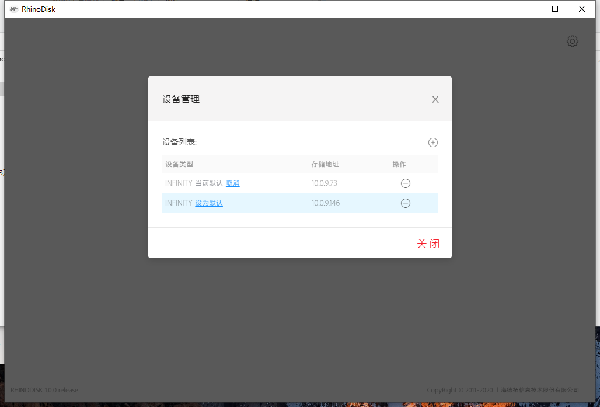
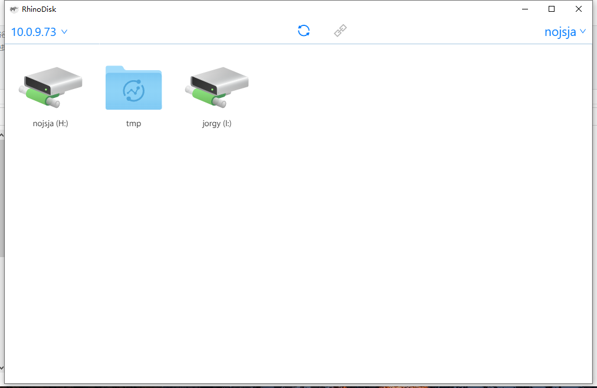
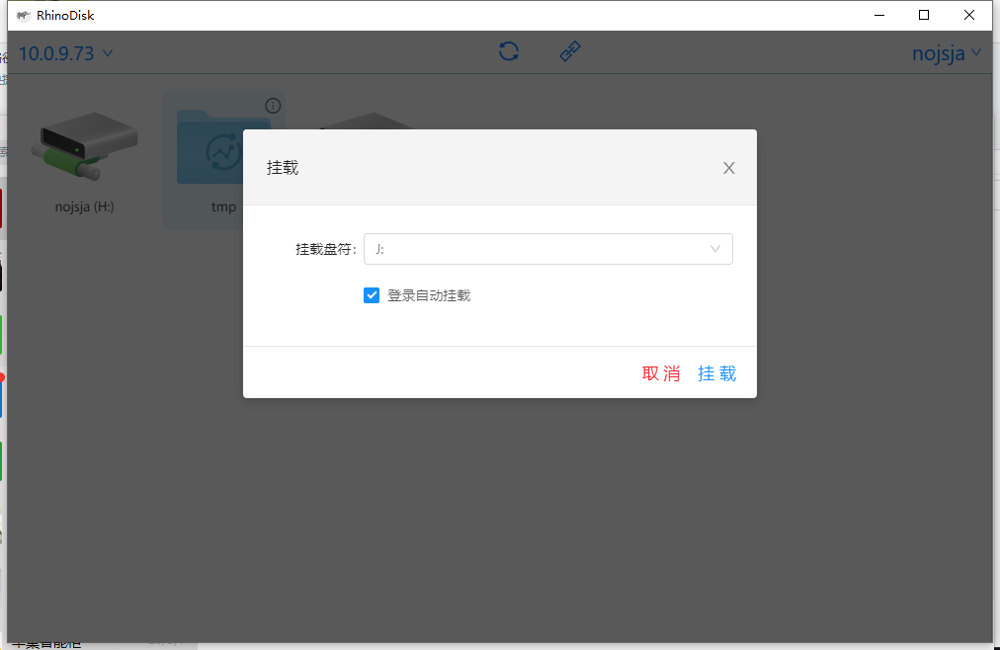
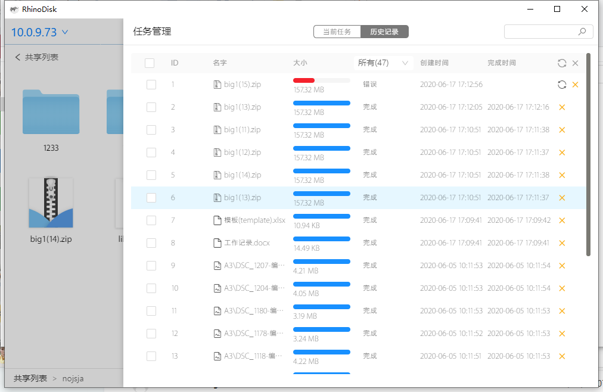

### 前言
---------------
最近拿到一个客户需求，需要利用现有部分后台接口和原生smb协议来实现一个windows平台的smb客户端，主要功能需要包含：集群节点管理、集群用户登录、远程共享目录挂载、共享目录浏览、目录权限设置、文件上传管理，其中目录权限设置和目录浏览接口已经被提供，其余几个功能的electron代码和web端代码需要由我负责。考虑整个项目由前端同事来实现且数据存储量较小，所以技术选型方面使用了支持跨平台的Electron框架和简易的本地json数据库[lowdb](https://github.com/typicode/lowdb)。

### 功能需求
---------------

#### 集群节点管理

客户端需要支持多个节点(每个节点所属集群不同)的添加、删除、设置默认节点(用于自动登录功能)，节点IP列表、默认节点属性、节点用户登录信息均在本地json数据库存储管理。

#### 集群用户登录

调用已有登录接口验证smb用户名和密码是否正确，然后拿到具有接口操作权限的access_token(注意直接走smb协议的操作无需使用token)，并且在本地json数据库存储用户名、密码、自动登录标识、用户节点登录记录等。

#### 远程共享目录挂载

同windows资源管理器原生功能一样，将远程主机的smb共享挂载为本地的一个磁盘，方便用户直接对文件和目录进行操作，所有挂载信息包括空闲盘符、共享挂载状态均需要即时获取以防数据不一致的情况

#### 文件上传管理

### 功能需求
---------------

### 总结
--------
Promise实现的难点其实是怎样考虑那个状态传递的过程(`analysisPromise`方法的实现)，各种回调的设计容易让人混乱，需要考虑各个promise对象的`原子性`同时又要保持各个可能出现相互嵌套的promise对象之间的依赖和联系。如果结构设计地比较合理的话，`Promise.all`、`Promise.race`这两个方法是很容易被实现出来的，因为它们只是对多个promise对象的状态管理而已。
