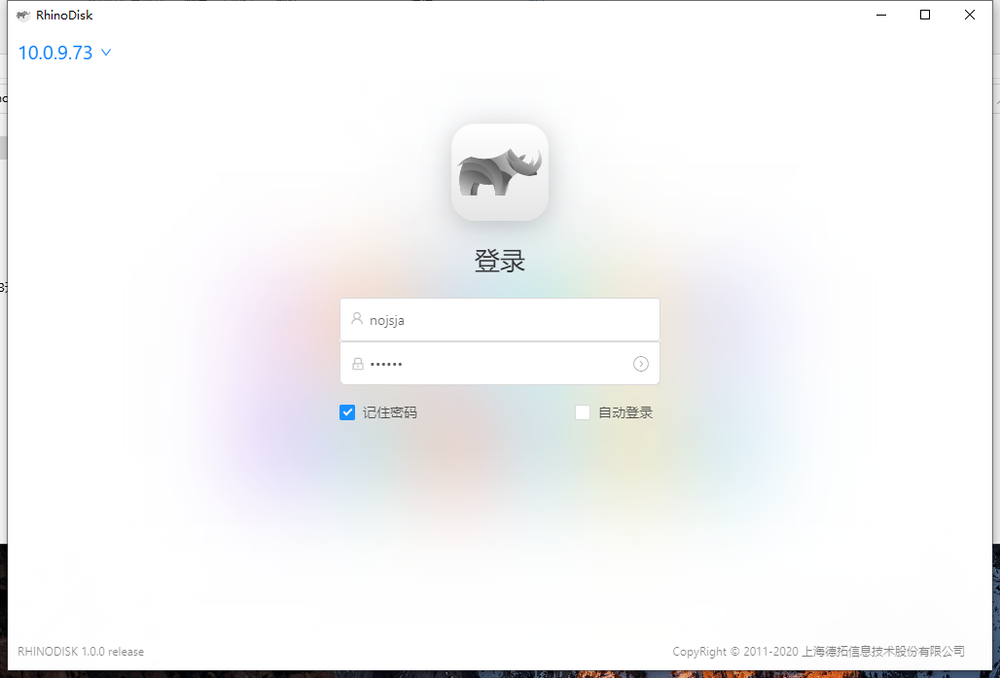
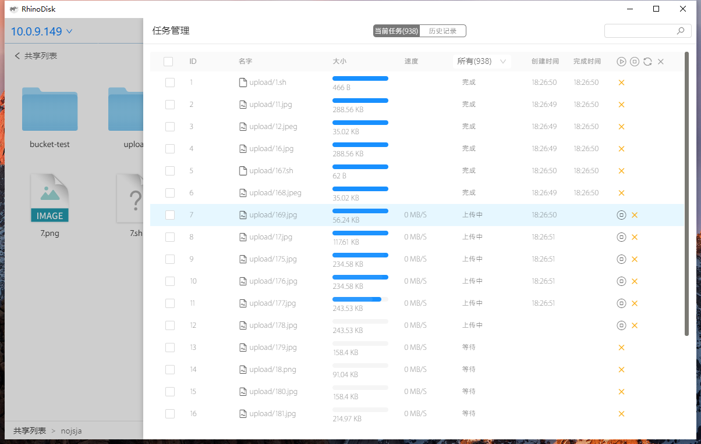

### 前言
---------------
最近拿到一个客户需求，需要利用现有部分后台接口和原生smb协议来实现一个windows平台的smb客户端，主要功能需要包含：存储集群节点管理、集群用户登录、远程共享目录挂载、共享目录浏览、目录权限设置、文件上传管理，其中目录权限设置和目录浏览接口已经被提供，其余几个功能的electron代码和web端代码需要由我负责。考虑整个项目由前端同事来实现且数据存储量较小、数据关系不复杂，所以技术选型方面使用了支持跨平台的Electron框架和易用的的本地json数据库[lowdb](https://github.com/typicode/lowdb)。

### 功能需求
---------------

#### 集群节点管理

1. 客户端需要支持多个节点(每个节点所属集群不同)的添加、删除操作
2. 支持设置默认节点操作用于自动登录功能
3. 添加节点的时候要进行ping逻辑判断目标节点是否可用
4. 调用存储集群ID获取接口保证每个集群只有一个节点被添加到集群管理列表

需求分析：节点IP列表、默认节点属性、节点用户登录信息均需要在本地json数据库存储管理，以便数据记录。


#### 集群用户登录

1. 支持已登录过客户端的用户自动下拉提示
2. 支持已记住密码的用户自动填充密码到输入框
3. 如果设置了默认节点，且默认节点的当前用户密码已经记住，则启动客户端时自动执行登录，类似QQ登录面板

需求分析：调用已有登录接口验证smb用户名和密码是否正确，然后拿到具有接口操作权限的access_token(注意直接走smb协议的操作无需使用token)，并且在本地json数据库存储用户名、密码、自动登录标识、用户节点登录记录等。



#### 远程共享目录挂载

1. windows资源管理器原生功能一样，将远程主机的smb共享挂载为本地的一个磁盘，方便用户使用windows资源管理器直接对文件和目录进行操作
2. 选择挂载设备时需要弹出所有空闲的磁盘盘符，支持范围C-Z

需求分析：同windows资源管理器原生功能一样，将远程主机的smb共享挂载为本地的一个磁盘，方便用户使用windows资源管理器直接对文件和目录进行操作，所有挂载信息包括空闲盘符、共享挂载状态 均需要使用windows cmd命令即时获取以防数据不一致的情况。


#### 文件上传管理

1. 文件上传管理能够查看当前任务列表的任务详情，包含上传速度、上传时间、完成时间、文件大小、文件名称，勾选进行中的任务后能够进行暂停、重传、删除、续传等操作。
2. 在任务列表的所有文件都被上传后会进行一次历史任务。
3. 任务历史记录中可以进行删除任务记录、恢复上传错误的历史任务(重传)等操作。
4. 切换不同节点重新登录用户上传任务不受影响，在当前节点重新登录用户上传任务会被强制终止，退出客户端后上传任务会被强制终止，各个用户的上传任务列表均不相同互不干扰，所有被强制终止的任务都能从历史任务列表中中恢复。

需求分析：当前任务列表即时存储于内存中，以便快速进行增删查改操作，任务历史记录使用json数据库进行本地存储；每次任务列表自动同步时将内存中的任务写入到本地json数据库里，并且任务列表数据从内存中释放。




### 实现难点
-----------

#### 公共部分

1. 多语言功能实现
2. 窗口大小动态记忆的实现
3. 托盘功能的实现
4. windows安装包打包配置

#### 集群节点管理

1. nodejs实现添加节点-ping逻辑  
使用[ping](https://github.com/danielzzz/node-ping)检测节点是否能联通，然后调用集群ID获取接口对比已经添加集群的ID和待添加集群的ID，判断是否重复添加同一个集群节点。
```js
/**
    * addNode [添加节点信息]
    * @param  {[String]} node [节点名]
    * @param  {[String]} type [节点类型]
    * @param  {[String]} defaulted [是否为默认节点]
    */
  addNode({ host, type='INFINITY', defaulted=false }) {
    return new Promise((resolve, reject) => {
      ping.sys.probe(host, (isAlive) => {
        let isFound;
        if (!isAlive) {
          return resolve({
            code: 600,
            result: global.lang.node.node_cannot_be_connected,
          });
        }
        isFound = (this.get('node') || []).find(node => node.host === host);

        if (isFound) {
          return resolve({
            code: 600,
            result: global.lang.node.node_add_repeat,
          });
        }
        this.getClusterID({ host }).then((rsp) => {
          if (rsp.code === 200) {
            if (rsp.result.isExit) {
              resolve({
                code: 600,
                result: global.lang.node.node_add_repeat_cluster,
              });
            } else {
              this.update('node', { host }, { host, type, defaulted, id: rsp.result.id }).then(() => {
                resolve({
                  code: 200,
                  result: host
                });
              });
            }
          } else {
            resolve(rsp);
          }
        });
      })
    })
  }

```

2. 

#### 集群用户登录

#### 远程共享目录挂载

#### 文件上传管理

### 总结
--------
